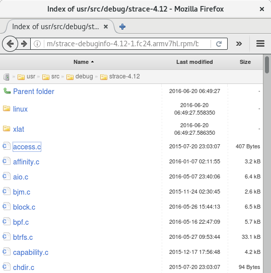
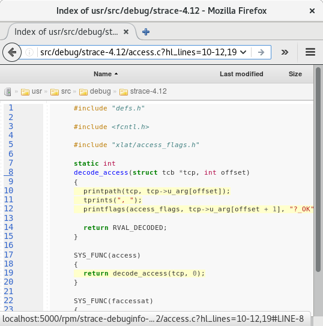

What
----
This is a quick proof of concept for a lightweight online RPM content
browser web service for packages from the Fedora build system.

This is similar to <https://sources.debian.net>, OpenGrok, LXR, etc

How it works
------------
Instead of needing to extract all historical RPMs in advance which would
take hundreds of gigabytes and tons of other resources, this downloads
existing RPMs on demand and extracts their content into a cache before
rendering them and serving them to the user.

Example URL:
<http://localhost:5000/rpm/nautilus-debuginfo-3.18.1-1.fc23.x86_64.rpm/browse/usr/src/debug/nautilus-3.18.1/libnautilus-private/nautilus-progress-info.c?hl_lines=96#LINE-96>
Compared to:
<http://sources.debian.net/src/nautilus/3.18.5-1/libnautilus-private/nautilus-progress-info.c/#L96>

Images
------
 

Use cases
---------
While this doesnt enable any mass-indexing (opengrok) or similar use
cases, it does enable web-based user browsing and linking of package
contents and source code for very little infrastructure effort or cost,
and could be useful until a proper solution is put in place.

One use case is to be able to generate permalink URLs deterministically
from stack traces to the specific source code used to build those
binaries. (For that situation, it looks like the source stored in the
debuginfo packages might be the best place to link to VS the raw SRPM 
package contents).

Example links are given for a stack trace recorded in FAF for a
nautilus bug, along with other examples and package types.

(Ideally, there would be a mechanical way of mapping debug symbols/lines
from a given binary all the way through the entire buildchain back to
upstream, but the simple -debuginfo approach seems like a good thing to 
have).

Something like this might also just be useful for casual access to RPM
contents.

Long term plans
---------------
Nothing really, just throwing this out as a feasibility demonstration.

Previous discussions
--------------------
<https://lists.fedoraproject.org/pipermail/users/2010-November/387149.html>
<https://lists.fedoraproject.org/archives/list/infrastructure@lists.fedoraproject.org/thread/LJJV4QCXDVN4MUKRXRN5CI5QGLGAW3YI/>

Misc
----
This is a rapid prototype, not maintainable or production safe code.
This uses shutil.rmtree() so be careful if modifying and running
locally or else it can nuke your homedir :)

Credit to libs in requirements.txt.

License
-------
This code is dedicated to the public domain to the maximum extent permitted by applicable law, pursuant to CC0 <http://creativecommons.org/publicdomain/zero/1.0/>
